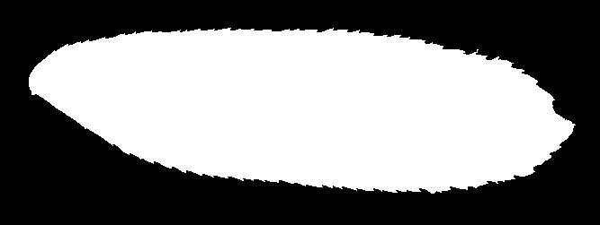
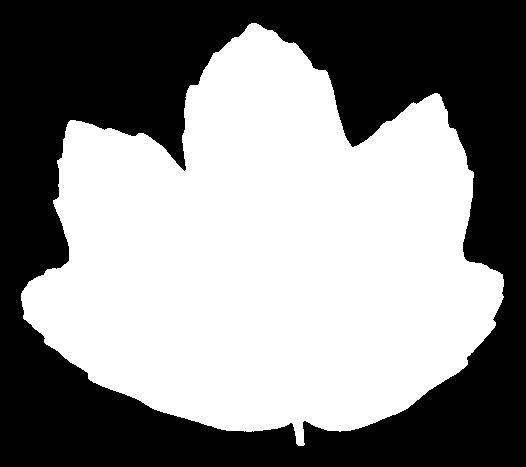

# leaf-classifier
Neural network classifier of leaf trees image based on fast.ai library and the kaggle photo database leaf-classification

Creation and run of a docker: 
`sudo docker build . --tag leafclassifier` 
`sudo docker run leafclassifier -p 8008:8008` 

You can deploy the docker on a service that runs docker like Haruko or Render for free

You can test the app using these photos

* It is a Pterocarya Stenoptera leaf

* It is an Acer opalus leaf

